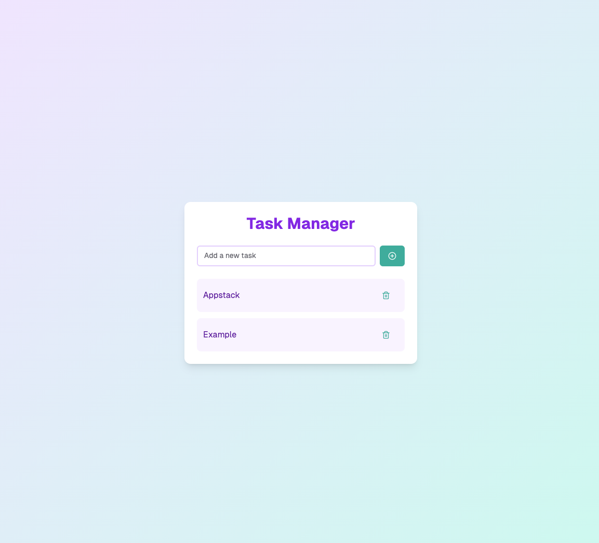

# Task Manager Exercise 🗂️

Welcome to the Task Manager coding exercise! This project will test your ability to build a simple task management application using **Next.js**, demonstrating your frontend skills, API interaction, and backend understanding.

## 🎯 Objective

Build a task management page with the following core functionality:

- ✅ Add new tasks
- 📋 View list of existing tasks  
- ❌ Delete tasks

## 🔧 Technical Requirements

### Frontend (React/Next.js)
- Create a task manager page with a form to add tasks
- Display the tasks in a vertical list
- Add delete functionality to remove each task

### Backend (API Routes)
- Use the provided SQLite database (pre-configured)
- Use tRPC to implement the backend routes
- Routes can be public for the exercise

## 🚀 Getting Started

1. Clone the repository
2. Run `npm run db:push` to initialize the database locally (db.sqlite file)
3. Start the development server with `npm run dev`
4. Open your browser and navigate to `http://localhost:3000`
5. Start coding!

## Bonus

Reproduce this design

Below is some information to help you reproduce the design:

1. Background Gradient
   - From: #EAE8FD (CSS class: from-purple-100)
   - To: #B2F5EA (CSS class: to-teal-100)

2. Heading Text
   - #805AD5 (CSS class: text-purple-600)

3. Button (Add Task)
   - Background Default: #38B2AC (CSS class: bg-teal-500)

4. Icons
   - Add Task Button
     - Icon: PlusCircle (from lucide-react)
     - Dimensions: width: 20px, height: 20px (CSS class: w-5 h-5)

   - Delete Task Button
     - Icon: Trash2 (from lucide-react)
     - Dimensions: width: 20px, height: 20px (CSS class: w-5 h-5)

5. For other elements, try to match the design as much as possible

